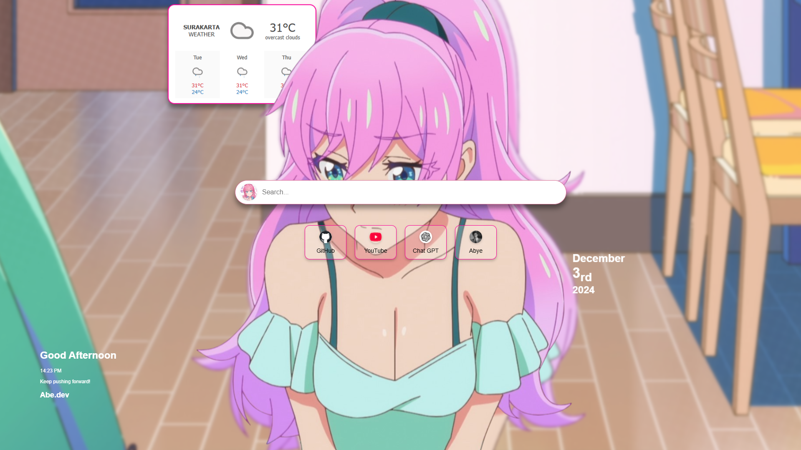

# **Shortcut Dashboard - Chrome Extension**

A beautiful and functional custom dashboard for Chrome's New Tab page. This extension allows you to create quick shortcuts with automatically fetched favicons from URLs and a clean, responsive design.

---

## **Features**
- 🌐 Automatically fetches favicons from URLs.
- ✨ Responsive design with a modern and clean layout.
- 🖌️ Easy to customize: Add or edit shortcuts in a few steps.
- 🔒 Privacy-focused: No external data is stored.

---

## **Preview**


---

## **Installation**
1. Clone or download the repository:
   ```bash
   git clone https://github.com/Arsybai/Akari-Tab.git
   ```
2. Open **Chrome** and navigate to `chrome://extensions/`.
3. Enable **Developer mode** (top right corner).
4. Click **Load unpacked** and select the folder containing the project.
5. Open a new tab to see your custom dashboard!

---

## **How to Add Shortcuts**
1. Open the file `index.html`.
2. Add a new `<li>` block inside the `<ul>` with the required URL and name:
   ```html
   <li>
       <a href="https://example.com" target="_blank">
           
           <span>Example</span>
       </a>
   </li>
   ```
3. Save the file and reload the extension in Chrome.

---

## **File Structure**
```
Akari-Tab/
├── assets/
│   ├── preview.png      # Preview image for README
├── index.html           # Main HTML file
├── styles.css           # CSS for styling
├── script.js            # JavaScript for dynamic functionality
├── manifest.json        # Chrome extension configuration
```

---

## **Customizing the Dashboard**
- **Background Image:** Replace `assets/bg.jpg` with your preferred background and update `styles.css`.
- **Styling:** Modify `styles.css` to tweak the look and feel.
- **JavaScript:** Edit `script.js` to add dynamic functionalities.

---

## **License**
This project is licensed under the [MIT License](LICENSE).

---

## **Contributing**
Feel free to fork the repository, create a feature branch, and submit a pull request. Contributions are always welcome!

---

If you have any questions or need help, let Akari know, Oniichan! 😊